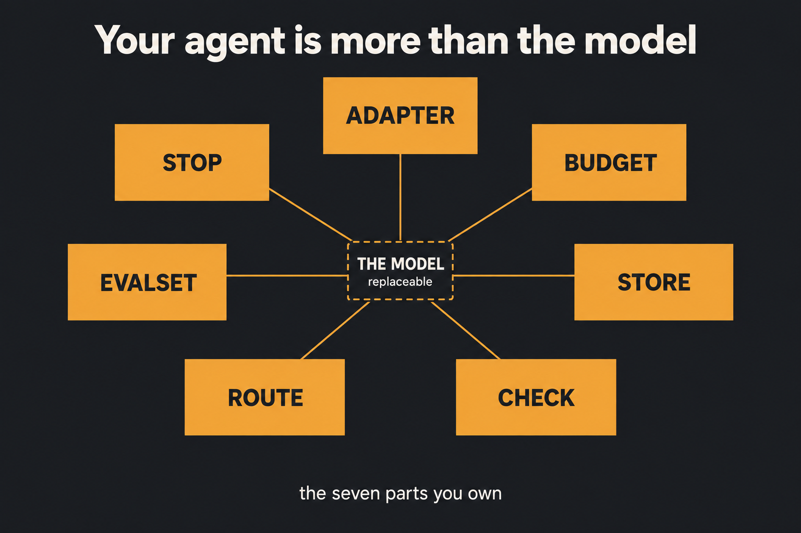
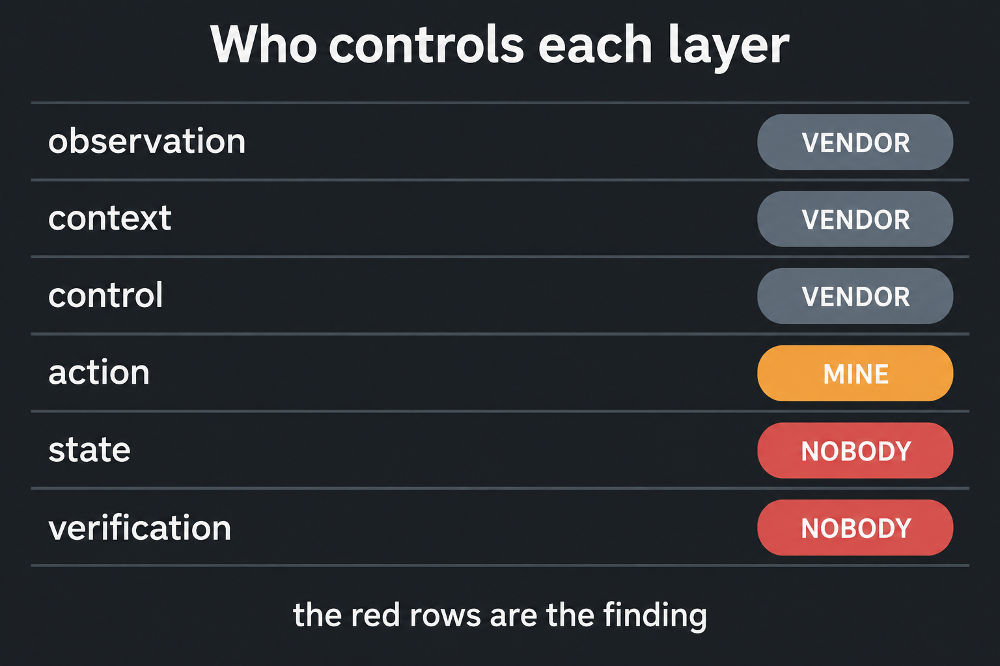
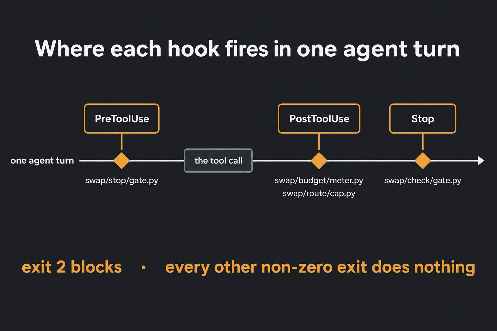

# swap-runbook

**The day a new model ships, you get a pass rate on your own jobs, a cost per
finished job, and a keep-or-reject decision: before lunch.**

Companion code to *Your Agent Is More Than the Model*, from
[youcanbuildthings.com](https://youcanbuildthings.com). Every part of `swap/` at
the paths the book uses.

In plain English: this repo is seven small pieces that sit around whatever AI
coding agent you already pay for, so you can measure it, cap what it spends, and
stop it doing something stupid. You'll meet words like *hook* and *adapter* in a
minute and you don't need them yet. Pick your line below and each folder explains
its piece when you get there.



## Start here

**I just finished the book and want my hooks wired up.**

```
./install.sh
```

It prints the four hook blocks with your own absolute paths already in them,
ready to paste. It touches nothing unless you ask it to twice.

**I want to see something run right now, without spending anything.**

```
python3 swap/route/price.py swap/route/runs.tsv
```

Arithmetic over a text file. It shows the cheap alias costing more per finished
job than the expensive one, which is Chapter 9 in six lines.

**I got stuck on one chapter and want a working version to diff against.**

Go straight to the copy table. Each folder is one chapter.

## The copy table

| Ch | Copy this | To here in your project |
|---|---|---|
| 2 | `swap/inventory.md` | `swap/inventory.md`, then wipe the right three columns |
| 3 | `swap/switching-cost.md` | `swap/switching-cost.md`, then re-price every row |
| 4 | `swap/swaptest/` | `swap/swaptest/`, then replace `fixtures/` and `job.md` |
| 5 | `swap/adapter/` | `swap/adapter/`, then edit `models.txt` |
| 6 | `swap/budget/meter.py` | `swap/budget/`, then wire on `PostToolUse` |
| 7 | `swap/store/store.py` | `swap/store/`, then write your own `plan.json` |
| 8 | `swap/check/gate.py` | `swap/check/`, then wire on `Stop` |
| 9 | `swap/route/` | `swap/route/`, then replace `runs.tsv` with your runs |
| 10 | `swap/evalset/` | `swap/evalset/`, then replace `jobs/` with your own |
| 11 | `swap/stop/` | `swap/stop/`, then wire on `PreToolUse` and edit `NEVER` |
| 12 | `swap/runbook.md`, `swap/stop-here.md` | `swap/`, then write your own stop-here list |

The paths match the book exactly, so anything you built alongside it drops into
the same tree without renaming.

## The chapter map

| Ch | What you build | Command | What success looks like |
|---|---|---|---|
| 2 | An inventory of who owns each layer | `claude doctor` | A row that comes back **nobody** |
| 3 | What leaving costs, in hours | by hand | A total, and one starred row |
| 4 | One job, two models, four numbers | `./swap/swaptest/run.sh fast` | Two complete rows from two aliases |
| 5 | The only file that names a vendor | `./swap/adapter/call.sh nope /dev/null /tmp /tmp/x` | Exit 64, naming the alias |
| 6 | A ceiling that fires | `python3 swap/budget/meter.py < event.json` | Exit 2, and a row saying `evicted` |
| 7 | Run state outside the conversation | `python3 swap/store/store.py brief` | A digest that doesn't grow |
| 8 | A gate that checks the claim | `python3 swap/check/gate.py < event.json` | Exit 2, naming each failure |
| 9 | Cost per finished job | `python3 swap/route/price.py runs.tsv` | The cheap alias isn't cheaper |
| 10 | A pass rate on your own jobs | `python3 swap/evalset/report.py results.tsv` | A rate **with an interval** |
| 11 | A tool call that doesn't happen | `touch swap/stop/HALT` | Exit 2, and no side effect on disk |
| 12 | The launch-day runbook | read it | A decision a colleague could argue with |



## The one rule that runs through all of it

Four of these are hooks, and they all live or die on one number.

**Exit 2 blocks. Every other non-zero exit is a non-blocking error, and execution
continues.** A hook you wrote with `exit 1` will log everything, block nothing,
and never tell you it fired.



## What it needs to run

Python 3.9 or newer and a POSIX shell. Everything here is standard library, so
there's nothing to install: no manifest, no dependencies.

Three commands call a model, so they need the agent CLI you already pay for and
they spend your own allowance: `swap/swaptest/run.sh`, `swap/adapter/call.sh` and
`swap/evalset/run-all.sh`. Everything else: the meter, the store, both gates,
the pricer, the report, every `check.sh`, and `install.sh`: runs with no key, no
account and no network.

**Nothing here tests a model's judgment**, and nothing here can. The test suite
covers the parts that parse, price, meter and gate. Whether a model does good
work on your jobs is what `swap/evalset/` is for, and only you can run that.

```
python3 -m unittest discover -s tests
```

## Contributing

Fixes welcome, especially where something here disagrees with a real machine.
New features are out of scope. This mirrors the book on purpose, and a part the
book doesn't walk you through is a part you'd own without understanding.

## License

MIT. Educational software that accompanies the book, provided as-is, with no
warranty.
