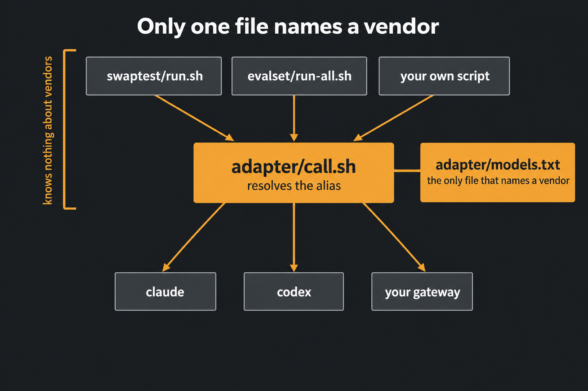

# Chapter 5: the only file that names a vendor

Two files. `models.txt` maps an alias to a CLI and a model string; `call.sh`
resolves the alias and runs the right one. Everything above this directory —
the swap test, the eval-set runner, the runbook: asks for `fast` or `deep` and
has no idea which company is behind it.

Adding a third contender is a new line in a text file.



## Run it

Test the resolver before you spend a token on it:

```
$ ./call.sh nosuchalias /dev/null /tmp /tmp/x.json ; echo "exit $?"
adapter: no alias 'nosuchalias' in models.txt
exit 64
```

That's the whole point of this check. **A dispatcher that fails silently is
worse than no dispatcher**, because it fails into whatever the default was.

Exit 64 is an unknown alias. Exit 65 is an alias pointing at a runner that
doesn't exist. Both name the thing that was wrong.

## What success looks like

Your Chapter 4 swap test runs from a one-line change and completes on two
aliases, and nothing above `models.txt` names a vendor.

## The line you must not drop

Every caller of `call.sh` ends with this:

```bash
|| { echo "adapter failed for '$ALIAS' (exit $?) — nothing ran" >&2; exit 64; }
```

The first version of this repo's `run.sh` didn't have it. Feed it a bad alias
and the adapter printed its error, the runner carried on, `sheet.py` found no
output file, and the sheet reported `json contract wrong`: a confident
diagnosis of a run that never happened. The step that was supposed to stop
things wrote a message instead of stopping them, which is this book's whole
thesis in miniature.

## On your own project

Add a row. Columns are alias, runner, model, then any extra flags:

```
myalias   claude   <your-model-string>
local     codex    gpt-oss:20b    --oss --local-provider ollama
```

Then run your Chapter 4 swap test against it. If the alias resolves and the call
returns a 400 telling you to upgrade, **that's step 0 of the runbook**, not a
bug in this file.

There's a Python alternative: `litellm` gives you one `completion()` across
providers, and it's a fine choice if you're already in Python. It's a
dependency, and this is a shell script that does the same job for this purpose,
so that's the trade. Note its licence: MIT except the `enterprise/` directory.
